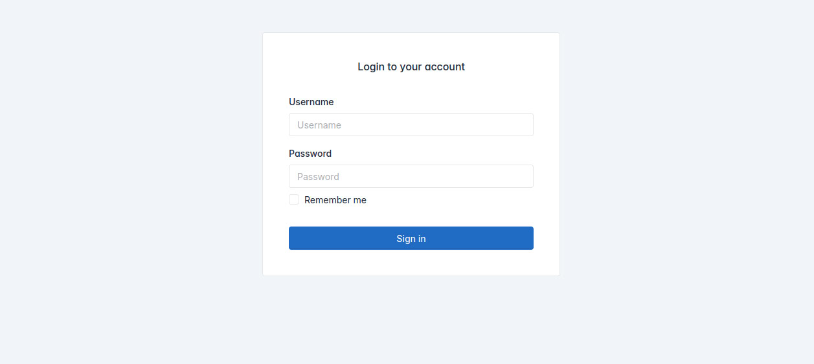
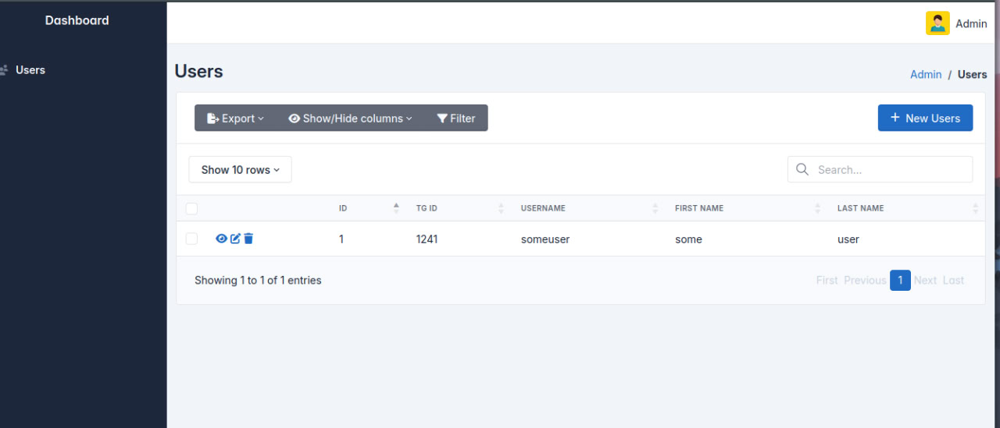

# Bot Template with Admin Dashboard

## Features
- Admin Dashboard
- Admin Login
- Template for Bot
- Systemd Services
- Nginx Configuration
- Dockerfile

## Installation
1. Clone the repository

3. `pip install -r requirements.txt`

4. `cp .env.example .env`

4. `fastapi dev main.py`

## Images

